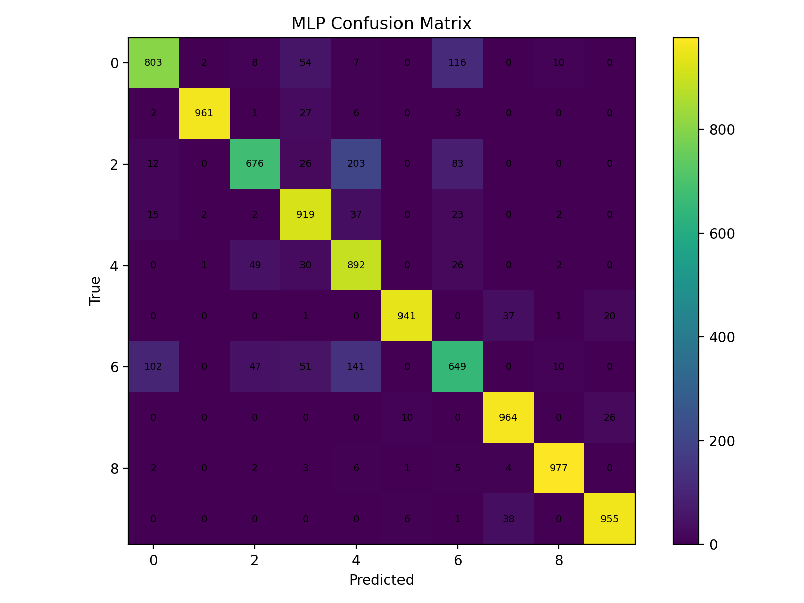
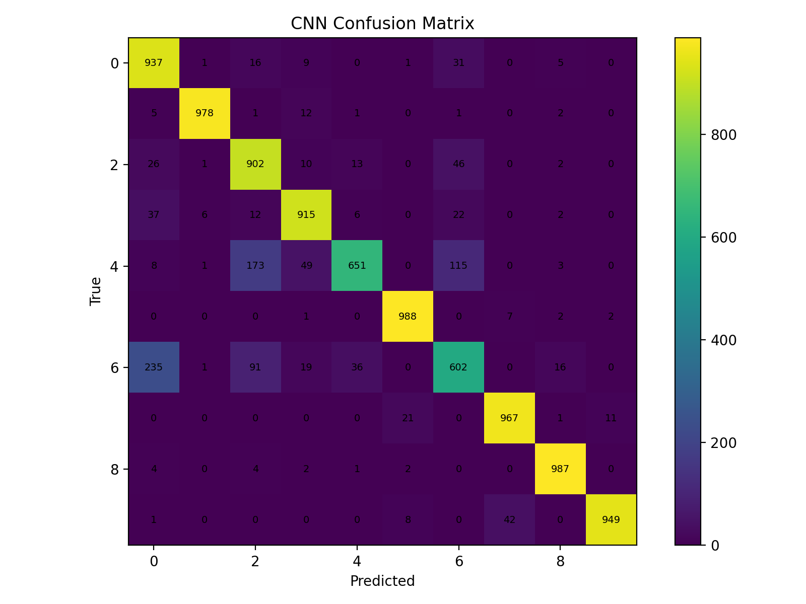

# Fashion-MNIST Classification (MLP vs CNN)

Fashion-MNIST Image Classification in PyTorch.

---

## Goal

Train and evaluate two neural network architectures on Fashion-MNIST and compare their performance using:

- Test Accuracy
- Confusion Matrix Analysis

The objective is to understand how spatial feature extraction (CNN) improves classification performance over a simple MLP baseline.

---

## Dataset

Fashion-MNIST contains:

- 60,000 training images
- 10,000 test images
- 10 clothing categories
- 28x28 grayscale images

Classes:
T-shirt/top, Trouser, Pullover, Dress, Coat, Sandal, Shirt, Sneaker, Bag, Ankle boot

---

## Models

### MLP (Baseline)
- Flattens image into a 784-length vector
- Fully connected layers
- No spatial awareness

### CNN
- Convolution layers extract spatial features
- MaxPooling reduces spatial dimensions
- Fully connected classifier head

---

## Results

| Model | Test Accuracy |
|--------|--------------|
| MLP | 87.37% |
| CNN | 88.76% |

The CNN outperformed the MLP baseline by approximately **1.39 percentage points**, demonstrating the benefit of preserving spatial structure when classifying image data.

---

## Confusion Matrices

### MLP


### CNN


---

## Key Observations

- The CNN achieved higher overall accuracy by leveraging spatial feature extraction.
- The MLP struggled more with visually similar upper-body clothing items such as T-shirt, Shirt, and Coat.
- Both models performed strongly on visually distinct classes such as Trouser, Bag, and Ankle boot.
- The confusion matrices show that most classification errors occur between categories with similar silhouettes.

---

## Setup (Windows / PowerShell)

```powershell
python -m venv .venv
.\.venv\Scripts\Activate.ps1
pip install -r requirements.txt
python train.py